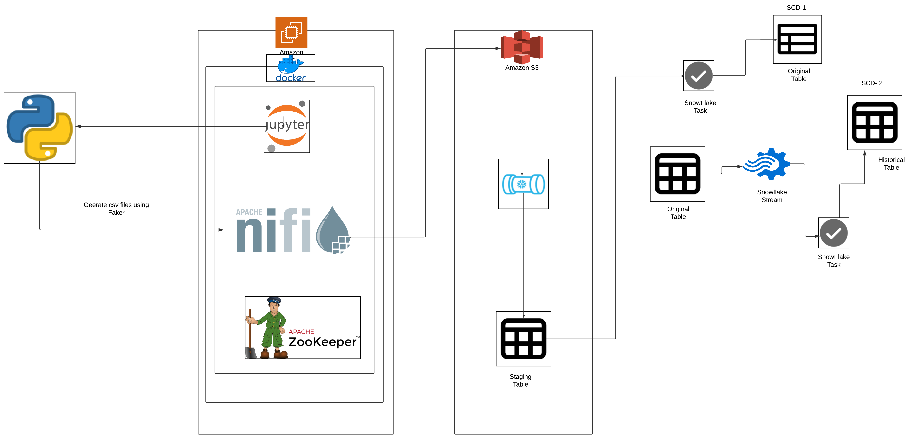

# CustomerTrack: Real-Time Data Streaming using Apache NiFi, AWS, Snowpipe, Stream & Task

## Overview
CustomerTrack is a real-time data pipeline that integrates AWS, Apache NiFi, and Snowflake to enable seamless data ingestion and efficient management of Slowly Changing Dimensions (SCD) Type 1 and Type 2 for customer data. This project showcases how to handle streaming data while preserving historical records and maintaining current state data.

## Technical Highlights
- Real-time data streaming pipeline
- Containerized flow using Docker
- Cloud-based infrastructure on AWS
- Automated data ingestion and processing
- Implementation of SCD1 and SCD2 patterns
- Efficient data versioning and historical tracking

## Architecture Components

### Data Generation Layer
- Custom Python script with the Faker library
- Docker containerization
- Volume mounting for data sharing
- Configurable data generation intervals

### Data Ingestion Layer
- Apache NiFi for data flow management
- Apache ZooKeeper for distributed coordination
- AWS EC2 for hosting services
- S3 bucket for data lake storage

### Data Processing Layer
- Snowflake for data warehousing
- Snowpipe for automated data loading
- Snow Stream for change data capture
- Scheduled data processing tasks

## Pipeline Workflow
1. **Generate data using Jupyter Notebook on AWS EC2.**  
   Synthetic customer data is created using the Faker library.
2. **Transfer data to AWS S3 using Apache NiFi.**  
   NiFi handles the flow of generated data into an S3 bucket.
3. **Load data into Snowflake staging tables via Snowpipe.**  
   Snowpipe automates the ingestion process for real-time updates.
4. **Run scheduled tasks to merge and update records.**  
   Data in Snowflake is processed to ensure consistency and accuracy.
5. **Implement SCD1 and SCD2 for real-time updates and historical tracking.**

## Technical Design Decisions
### SCD1 and SCD2 Implementation
- **SCD1 Main Table**:
  - Maintains current, accurate data
  - Optimized for query performance
- **SCD2 History Table**:
  - Tracks historical changes
  - Supports point-in-time analysis

### Performance Optimization
- Separation of current and historical data reduces compute time.
- Stream-based change capture minimizes processing overhead.

### Scalability Considerations
- Containerized architecture ensures easy scaling.
- Cloud-based infrastructure allows flexible resource allocation.

## Conclusion
This project demonstrates how to efficiently manage real-time data ingestion and historical tracking using AWS, Apache NiFi, and Snowflake. It provides a scalable solution for businesses that require near real-time insights while preserving historical data.
